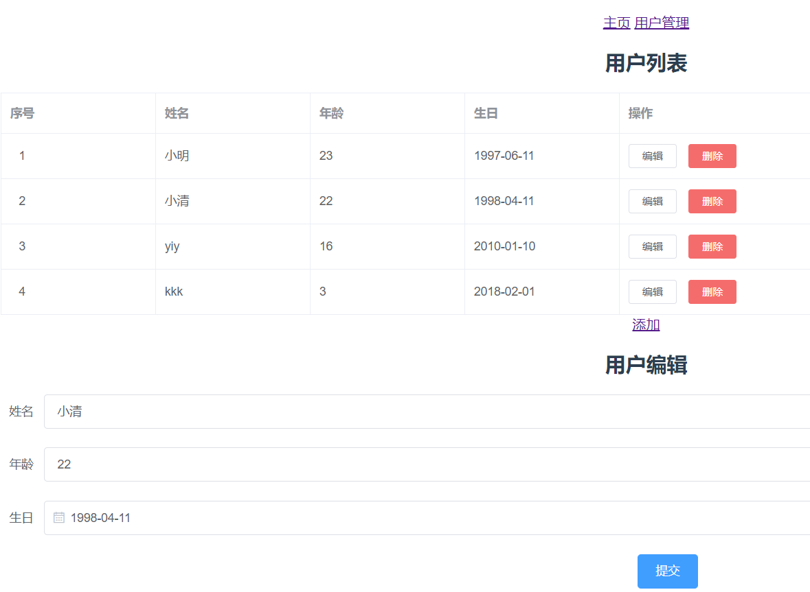

# elementdemo

> 用vue和element ui实现的用户增删改查页面，包含技术栈：
>
> 1. vue路由，包括子路由、路由切换、路由监听、路由传值；
> 2. axios接口调用；
> 3. element-ui表格和表单使用；
>
> 

## Build Setup

``` bash
# install dependencies
npm install

# serve with hot reload at localhost:8080
npm run dev

# build for production with minification
npm run build

# build for production and view the bundle analyzer report
npm run build --report
```

For a detailed explanation on how things work, check out the [guide](http://vuejs-templates.github.io/webpack/) and [docs for vue-loader](http://vuejs.github.io/vue-loader).
